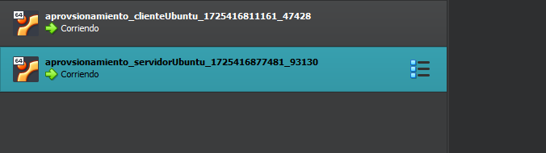

# Primer paso
# se creo el vagrantfile y se aprovisiono con lo requerido por el punto 3 

# Segundo paso
# Se creo el script.sh y se realizo el aprovisionamiento 

# Comando para levantar vm con el aprovisionamiento incluido en archivo .sh
vagrant up --provision

# Ira a buscar el archivo, gracias a la siguiente linea implicita en el archivo Vagrantfile
 servidorUbuntu.vm.provision "shell", path: "script.sh"

# una vez aprovisionadas las maquinas, se valida con virtualBox 
